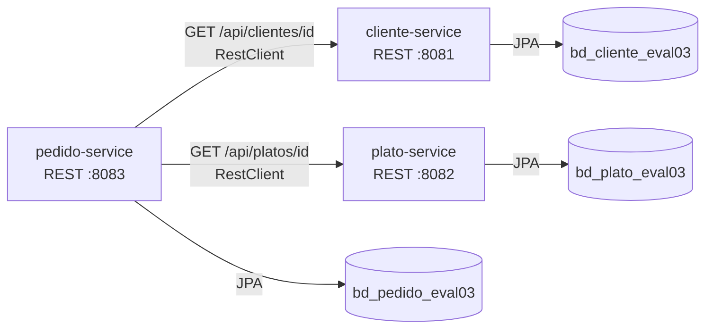

# Diagrama de arquitectura

```mermaid
flowchart LR
    C[cliente-service<br/>REST :8081] -->|JPA| BC[(bd_cliente_eval03)]
    P[plato-service<br/>REST :8082] -->|JPA| BP[(bd_plato_eval03)]
    O[pedido-service<br/>REST :8083] -->|JPA| BO[(bd_pedido_eval03)]
    O -->|GET /api/clientes/id<br/>RestClient| C
    O -->|GET /api/platos/id<br/>RestClient| P
```

Cada servicio persiste únicamente en su propia base de datos. El pedido almacena `idCliente` e `idPlato` como referencias y consulta los otros servicios mediante REST.
